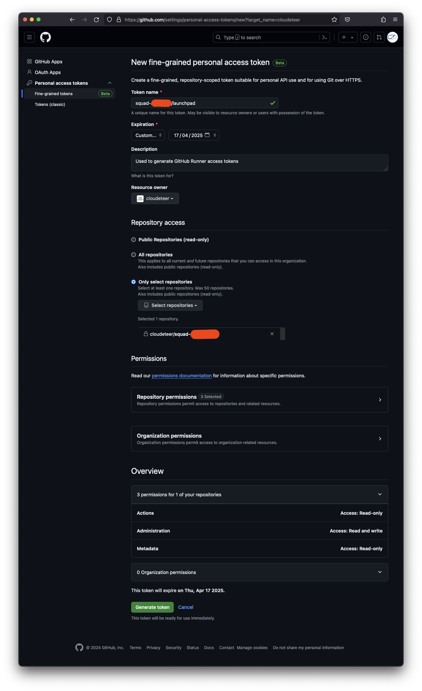

## Pre Requirements

- Access to a Azure subscription of the customer with `Owner` permissions (service principal or human user)
- Successfully authenticated with `az` CLI
- GitHub team [service-accounts](https://github.com/orgs/cloudeteer/teams/service-accounts) must be `admin` of the squad repo
- [Firewall approvals](./docs/firewall-approvals.md)

## Install CDT IaC Launchpad

> [!NOTE]
> Do the following steps first, then you can use this module with only a few variables as we show in our [example](https://github.com/cloudeteer/terraform-azurerm-launchpad/blob/main/examples/usage/main.tf).

### 1. Create GitHub Personal Access Token (PAT)

The Launchpad Virtual Machine needs permission to register GitHub runners in the desired repository. To be able to do this automatically, a GitHub Personal Access Token (PAT) is required.

Login as GitHub user (with proper permission) and create an (organization-owned) GitHub PAT with the following configuration:

> [!IMPORTANT]
> The resource owner must be your Companies organization, and it cannot be changed after the PAT is created.

| Property          | Value                                                             |
|-------------------|-------------------------------------------------------------------|
| Token name        | `<...>/launchpad` (replace `<...>` with the actual customer name) |
| Expiration        | Custom: 1 year                                                    |
| Description       | `Used to generate GitHub Runner access tokens`                    |
| Resource owner:   | `<YOUR_COMPANY>` – The organization                               |
| Repository access | "Only selected repositories" – Select the customer repository     |
| Permissions       | Repository permissions: Actions: `read`, Administration: `write`  |

<details>
<summary>Screenshot: GitHub PAT Settings</summary>


</details>

Save the PAT in at a secure place (e.g. Passwordmanager).

For the initial Launchpad installation open your local shell
and set the GitHub PAT and squad repository as `TF_VAR_` environment variables.

```shell
export TF_VAR_runner_github_pat=github_pat_<...>
export TF_VAR_runner_github_repo=YOUR_COMPANY/-<...>
```

Finally, set the GitHub secret `IAC_LAUNCHPAD_RUNNER_GITHUB_PAT` in the customer repository that contains this PAT:

```shell
gh secret set IAC_LAUNCHPAD_RUNNER_GITHUB_PAT --repo "$TF_VAR_runner_github_repo"
```

### 2. Initial deployment

Deploy initially:

```sh
# This IP address will be utilized for the initial network rules for the storage account and key vault.
export TF_VAR_init_access_ip_address=$(curl -s https://ipinfo.io/ip)

terraform init
terraform apply -var 'init=true' -var 'runner_public_ip_address=true'
```

Add the module output `ARM_CLIENT_ID` as GitHub secret to your repository:

```shell
gh secret set CDT_IAC_LAUNCHPAD_AZURE_CLIENT_ID --repo "$TF_VAR_runner_github_repo"
```

### 3. Configure Terraform Backend

Update the following Terraform backend parameters in the `main.tf` file:

- Set the `storage_account_name` to the value of the Terraform output `tfstate_storage_account_name`
- Uncomment the entire `backend.azurerm` block to enable Azure backend configuration.

To complete this step commit your changes and push them to remote.

### 4. Migrate Terraform State File

Run:

```sh
terraform init -migrate-state
```

### 5. Remove Local State

Finally, delete the local state file:

```sh
rm terraform.tfstate terraform.tfstate.backup
```

### 6. Final Terraform Apply

After successfully registering the GitHub Action runner, proceed to apply the Terraform code for the last time locally without passing the `init=true`

> [!CAUTION]
> Ensure the specified managed identity has the necessary permissions. Recommended: Assign the `Owner` role at a management group level.

> [!CAUTION]
> Running Terraform locally will no longer be possible after this step and the Azure Storage Account will be locked, so no remove is accidentally possible.

Run the following command locally:

```sh
terraform apply -var 'runner_public_ip_address=true'
```

Omit the `-var 'runner_public_ip_address=true'` if the virtual network has internet access through an HUB without a dedicated public IP address.
